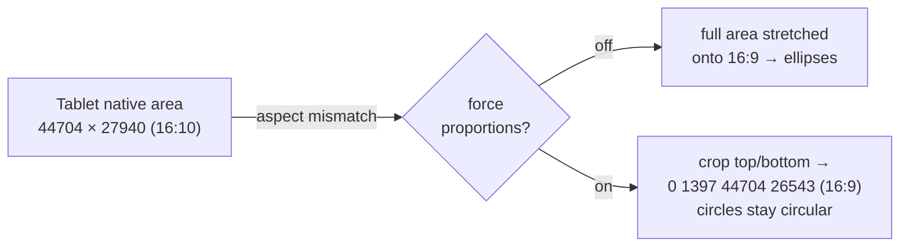
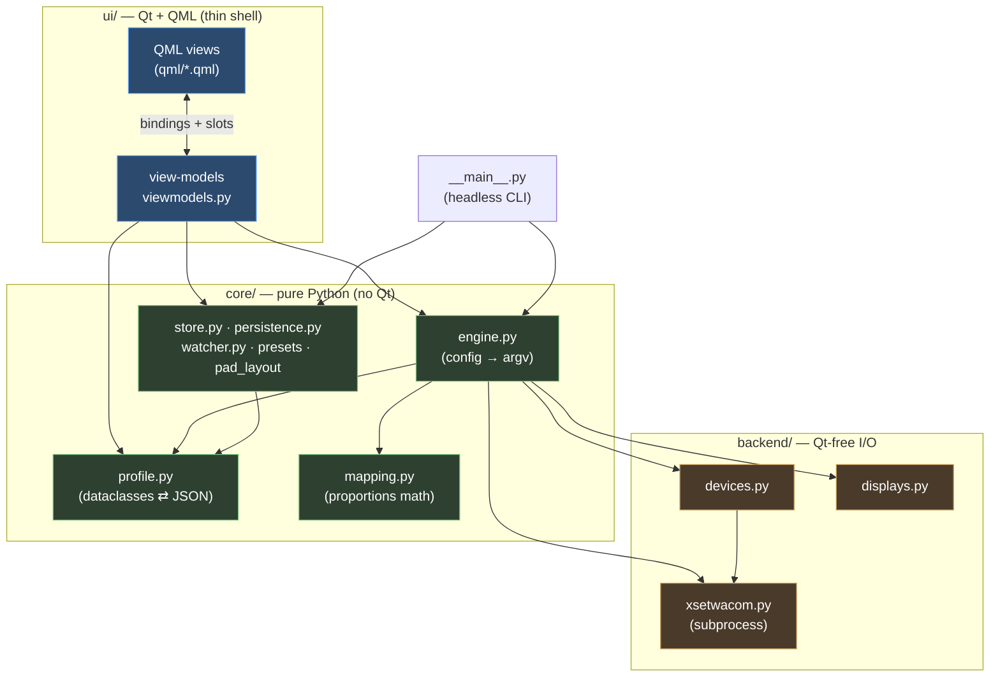
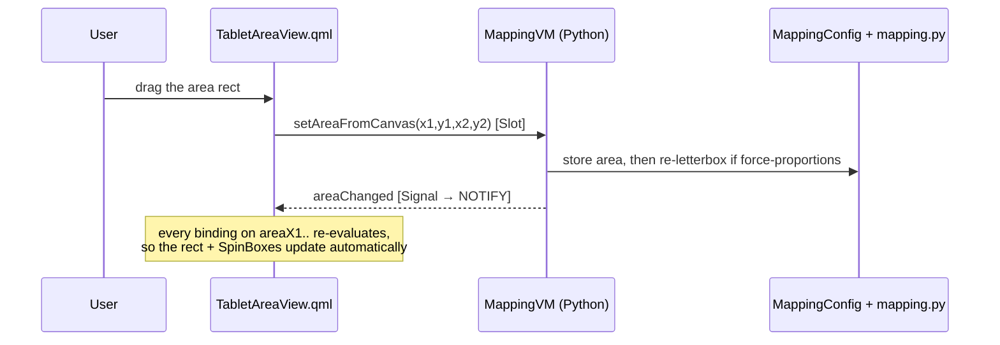
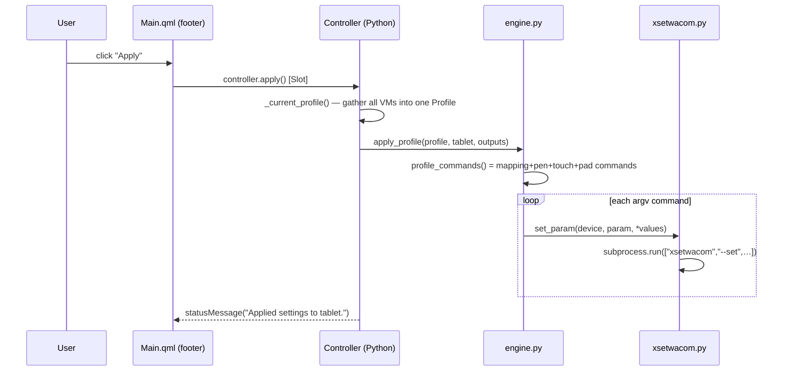
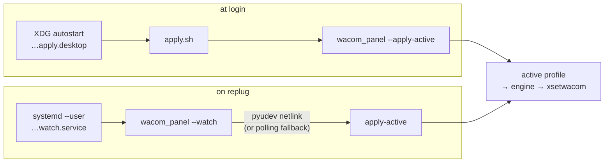

# Wacom Control Panel

A graphical [`xsetwacom`](https://github.com/linuxwacom/xf86-input-wacom) frontend for
Linux/X11, built with **PySide6 / QtQuick** (Material Dark). Its centerpiece is a visual
tablet-to-display mapping editor with **forced proportions** — aspect-correct, distortion-free
mapping that the stock control panels lack — plus named profiles that survive reboot, logout,
and replug.

> **X11 only.** `xsetwacom` does nothing under Wayland. The app detects your session type and
> warns rather than misbehaving.

This README is a **developer overview**. It walks the whole kit top to bottom, with diagrams,
and — since the UI is QtQuick/QML — includes a primer aimed at developers who know Qt/Widgets
but are new to QML. Each subpackage has its own deeper `README.md`:

- [`wacom_panel/backend/`](wacom_panel/backend/README.md) — the Qt-free shell-out layer.
- [`wacom_panel/core/`](wacom_panel/core/README.md) — pure logic, models, persistence.
- [`wacom_panel/ui/`](wacom_panel/ui/README.md) — the QML views + the MVVM bridge (**the QML teaching deep-dive**).
- [`wacom_panel/layouts/`](wacom_panel/layouts/README.md) — pad-layout JSON schema.

---

## Contents

1. [Why this exists](#1-why-this-exists)
2. [Quick start](#2-quick-start)
3. [Architecture at a glance](#3-architecture-at-a-glance)
4. [The three layers](#4-the-three-layers)
5. [Data flow: editing and applying](#5-data-flow-editing-and-applying)
6. [QtQuick/QML for Qt developers](#6-qtquickqml-for-qt-developers)
7. [Persistence (auto-reapply)](#7-persistence-auto-reapply)
8. [Testing](#8-testing)
9. [Hard-won hardware notes](#9-hard-won-hardware-notes)
10. [Repository map](#10-repository-map)
11. [CLI reference](#11-cli-reference)

---

## 1. Why this exists

`xsetwacom` maps the tablet's active **Area** rectangle (in device units) *linearly* onto a
target output. If the Area's aspect ratio ≠ the output's aspect ratio, the pen feels
stretched — a circle drawn on the tablet comes out as an ellipse on screen.

"Force proportions" shrinks the Area to **letterbox-match** the output, keeping the maximum
usable surface:



The math is pure and lives in [`core/mapping.py`](wacom_panel/core/mapping.py):
`fit_rect` finds the largest rectangle of the target aspect that fits the tablet, `place_rect`
anchors it, and rotation (`cw`/`ccw`) swaps the target aspect because the axes swap.

The app wraps that math in a friendly UI, then makes it **stick** (profiles + auto-reapply),
which the stock tools also don't do without root.

---

## 2. Quick start

```sh
python3 -m venv .venv
. .venv/bin/activate
pip install -e ".[dev,udev]"      # udev extra = event-driven hotplug watcher

# headless smoke test — prints devices/outputs, applies nothing
python -m wacom_panel --list

# preview the exact xsetwacom commands for a mapping (no changes made)
python -m wacom_panel --apply --output DP-4 --force-proportions --dry-run

# run the GUI
python -m wacom_panel

# tests (headless; Qt runs offscreen)
QT_QPA_PLATFORM=offscreen pytest
ruff check wacom_panel tests
```

Entry points (see [`pyproject.toml`](pyproject.toml)):

| Command | Maps to | Purpose |
| --- | --- | --- |
| `python -m wacom_panel` | `__main__:main` | CLI dispatch; **no flags → launches GUI** |
| `wacom-panel` | `__main__:main` | same, as an installed console script |
| `wacom-panel-gui` | `app:main` | GUI directly (a desktop/`.gui-scripts` entry) |

---

## 3. Architecture at a glance

Three layers with a strict **one-way dependency rule** — dependencies point *downward* only.
The two lower layers never import Qt, so all the real logic is unit-testable without a display.



**The rule in one line:** `ui` → `core` → `backend`. Nothing in `core`/`backend` imports
`PySide6`; the GUI and the headless CLI are just two different front-ends over the same
`core` functions, which is why `--dry-run` previews exactly what the GUI would apply.

---

## 4. The three layers

### `backend/` — talk to the system (no Qt)
Thin, pure wrappers over external tools, each with a parse function separated from the I/O so
tests feed in captured fixture text.

- **`xsetwacom.py`** — every call uses the argv-list form of `subprocess.run`, so device names
  with spaces need no shell quoting. A module-level `dry_run` flag (or per-call `dry=`) makes
  mutating calls *return* the command instead of running it.
- **`devices.py`** — parses `xsetwacom --list devices` into `Device`s and **groups** the
  per-tool devices (stylus/eraser/cursor/pad/touch) back into a `Tablet`, because a mapping
  must be applied to the pen-tool group together.
- **`displays.py`** — parses `xrandr --listmonitors` into `Output`s (connector name + pixel
  geometry), and computes the `desktop_bounds` bounding box for whole-desktop mapping.

More in [`backend/README.md`](wacom_panel/backend/README.md).

### `core/` — the brains (pure Python)
- **`profile.py`** — the data model: `MappingConfig`, `PenConfig`, `TouchConfig`, `PadConfig`,
  `ButtonAction`, bundled in a `Profile` that serialises to/from JSON. `ButtonAction.to_xsetwacom()`
  is the single place that knows the action string grammar.
- **`engine.py`** — turns a `Profile` (+ live `Tablet`/`Output`s) into a list of `xsetwacom`
  argv commands, then optionally runs them. **One source of truth** shared by GUI, CLI, and the
  generated apply-script.
- **`mapping.py`** — the force-proportions / anchor / zoom / rotation math (§1).
- **`store.py`** — named profiles on disk under `~/.config/wacom-control-panel/`, plus the
  "active profile" pointer.
- **`persistence.py` + `watcher.py`** — auto-reapply (§7).
- **`pressure_presets.py`, `pad_layout.py`** — named pressure curves; physical pad layouts.

More in [`core/README.md`](wacom_panel/core/README.md).

### `ui/` — the face (Qt + QML)
- **`viewmodels.py`** — `QObject` view-models (`Controller` + `MappingVM`/`PenVM`/`TouchVM`/`PadVM`)
  that expose `core` to QML via `Property`/`Signal`/`Slot`. **All UI logic lives here; `core`
  stays pure.**
- **`qml/*.qml`** — the declarative views, one page per tab, plus reusable canvas components.
- **`app.py`** — bootstraps `QGuiApplication` + `QQmlApplicationEngine`, injects the
  `Controller` as the `controller` context property, loads `Main.qml`.

The MVVM bridge is the most interesting part if you're new to QML — see §6 and the
[`ui/README.md`](wacom_panel/ui/README.md) deep-dive.

---

## 5. Data flow: editing and applying

Two representative round-trips. **Edits** flow QML → view-model → `core` model and bounce back
to the canvas via bindings; **Apply** assembles a `Profile` and pushes it through the engine to
`xsetwacom`.

**Editing the mapping (e.g. dragging the area rectangle):**



**Clicking Apply:**



---

## 6. QtQuick/QML for Qt developers

If you know Qt Widgets, the mental shift is **imperative → declarative**. The full walkthrough
(with code from this repo) is in [`ui/README.md`](wacom_panel/ui/README.md); the essentials:

**The bridge is one object.** `app.py` creates a `Controller` `QObject` and registers it as a
QML *context property*:

```python
engine.rootContext().setContextProperty("controller", controller)
engine.load(QUrl.fromLocalFile(".../Main.qml"))
```

From then on every `.qml` file can read `controller.mapping.areaX1`, call
`controller.apply()`, etc. — no per-widget wiring.

**Properties are bindings, not setters you call.** In Widgets you'd write
`spinBox.setValue(x)` whenever the model changes. In QML you declare the *relationship* once
and Qt keeps it true:

```qml
// TabletAreaView.qml — the rect's geometry IS the view-model's area
Rectangle {
    x: root.devToPxX(controller.mapping.areaX1)
    width: (controller.mapping.areaX2 - controller.mapping.areaX1) * root.s
}
```

When `MappingVM` emits its `areaChanged` signal, every expression that read `areaX1`
re-evaluates. The Python side opts in by declaring the `NOTIFY` signal on the property:

```python
areaChanged = Signal()
areaX1 = Property(int, lambda self: self._area().x1, notify=areaChanged)
```

**Edits go back through `Slot`s (or writable `Property` setters).** QML calls Python; Python
mutates the pure `core` model and emits the NOTIFY signal to close the loop:

```python
@Slot(int, int, int, int)
def setAreaFromCanvas(self, x1, y1, x2, y2):
    self._m.set_area(Area(x1, y1, x2, y2))
    self.areaChanged.emit()
```

This repo deliberately uses a **read-property + explicit-setter** shape (rather than
two-way `property` bindings) so the data flow stays one-directional and easy to reason about.

**Other QML-isms you'll meet here**, all explained in the ui doc:
- `Repeater { model: controller.mapping.outputRects }` rendering a `QVariantList` of dicts.
- `StackLayout { currentIndex: tabs.currentIndex }` for tabbed pages.
- `Canvas` for imperative 2-D painting (the pressure curve) *inside* the declarative tree.
- `DragHandler` vs `MouseArea` — why the curve handles use the former (exclusive grab that
  survives stylus input).
- `Material.theme: Material.Dark` and the custom dark tool-bars.

---

## 7. Persistence (auto-reapply)

`xsetwacom` settings are runtime-only — they evaporate on logout or replug. The "Reapply on
login & replug" toggle (or the CLI) installs **userspace** hooks, no root, no `/etc` udev rules:



```sh
python -m wacom_panel --install-persistence     # writes autostart + systemd --user unit
python -m wacom_panel --uninstall-persistence
python -m wacom_panel --apply-active            # apply the active profile now (hook target)
python -m wacom_panel --watch                   # the hotplug watcher (the service runs this)
```

`persistence.py` keeps its file *rendering* pure (returns strings) so the generated files are
unit-tested without touching the real system; `install()`/`uninstall()` do the side effects.

---

## 8. Testing

`pytest` over the `core`/`backend` logic and the view-models — **no real device or display
needed**:

- **Parsing** is tested against captured fixture text (`xsetwacom --list`, `xrandr
  --listmonitors`, pad `-s --get … all`).
- **Mapping math** asserts `forced_area` yields the target aspect, correct centering, and the
  rotation axis-swap.
- **Command building** asserts the exact `xsetwacom` argv for each config (this is what makes
  `--dry-run` trustworthy).
- **View-models** run under `QT_QPA_PLATFORM=offscreen` so QObject/Property/Slot behaviour is
  covered headlessly.

```sh
QT_QPA_PLATFORM=offscreen pytest -q
```

---

## 9. Hard-won hardware notes

Things that cost real debugging on an Intuos Pro M (PTH-660) and shaped the design:

- **Pad buttons emit keystrokes only.** A pad express-key or ring mapped to a *mouse button*
  (incl. scroll 4/5) fires raw events but **no cooked event reaches apps** on X /
  `xf86-input-wacom`; `key` actions (Shift, arrows, Page keys) work. So the Pad tab offers a
  **keystroke-only** action menu and the ring scrolls via arrow keys (one line per detent).
- **The pad's button numbers must be measured, not assumed.** libwacom's letter order did *not*
  match reality. Verified by pressing each key while watching `xinput test-xi2 <pad-id>`:
  top keys = 2,3,8,9; centre = 1; bottom = 10–13; clockwise = `AbsWheelDown`.
- **Cinnamon's `csd-wacom` is *not* the villain** — it doesn't grab the pad; disabling it
  changed nothing. (We chased it; it was a red herring. The real bug was wrong button numbers.)
- **Probe native area non-destructively.** Reading the *current* `Area` to compute a new one
  shrinks the tablet cumulatively on every Apply. `engine.tablet_native_area` instead probes
  via `ResetArea`, restores the previous area, and caches the result per process.
- **Touch-ring "modes" are a proprietary-driver feature.** xsetwacom exposes one `AbsWheelUp`/
  `Down` pair with no per-mode multiplexing, so the ring's centre is just a normal bindable key.

---

## 10. Repository map

```
wacom_panel/
├── __main__.py           # CLI dispatch; no flags → GUI
├── app.py                # QtQuick bootstrap (QQmlApplicationEngine + context property)
├── backend/              # Qt-free I/O — see backend/README.md
│   ├── xsetwacom.py      #   subprocess wrapper (argv form, dry_run)
│   ├── devices.py        #   parse --list devices; group tools → Tablet
│   └── displays.py       #   parse xrandr --listmonitors → Output
├── core/                 # pure logic — see core/README.md
│   ├── profile.py        #   dataclasses ⇄ JSON; ButtonAction grammar
│   ├── engine.py         #   Profile → xsetwacom argv → run
│   ├── mapping.py        #   force-proportions math
│   ├── store.py          #   profiles on disk + active pointer
│   ├── persistence.py    #   login autostart + systemd --user unit (pure renderers)
│   ├── watcher.py        #   pyudev hotplug watcher (polling fallback)
│   ├── pressure_presets.py
│   └── pad_layout.py     #   physical pad layout from JSON
├── layouts/              # pad-layout JSON — see layouts/README.md
│   └── intuos-pro-m.json
└── ui/                   # Qt + QML — see ui/README.md
    ├── viewmodels.py     #   QObject view-models (the MVVM bridge)
    └── qml/
        ├── Main.qml              # window, profile bar, tabs, footer, dialogs
        ├── MappingPage.qml       # + ScreenView / TabletAreaView canvases
        ├── PenPage.qml           # + PressureCurve (Canvas + DragHandler)
        ├── PadPage.qml           # spatial pad mock + ActionEditor
        ├── TouchPage.qml
        └── ActionEditor.qml      # reusable action picker (mouse vs keyboard-only)
tests/                    # pytest over core/backend/viewmodels (offscreen)
```

---

## 11. CLI reference

```
python -m wacom_panel [no flags]      launch the GUI
  --list                              list tablets + outputs, then exit
  --apply                             apply a mapping headlessly
    --output DP-4                       target connector (omit = whole desktop)
    --force-proportions                 letterbox to the output aspect
    --rotate {none,cw,ccw,half}
    --mode {Absolute,Relative}
    --zoom 0.0–1.0                      use less of the tablet
    --touch                             also map the touch device
    --dry-run                           print commands instead of running
  --apply-active                      apply the active saved profile (hook target)
  --watch                             run the hotplug watcher
  --install-persistence               install login autostart + systemd --user watcher
  --uninstall-persistence             remove the auto-reapply hooks
```

---

## License

MIT
