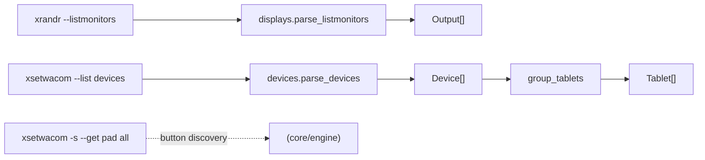
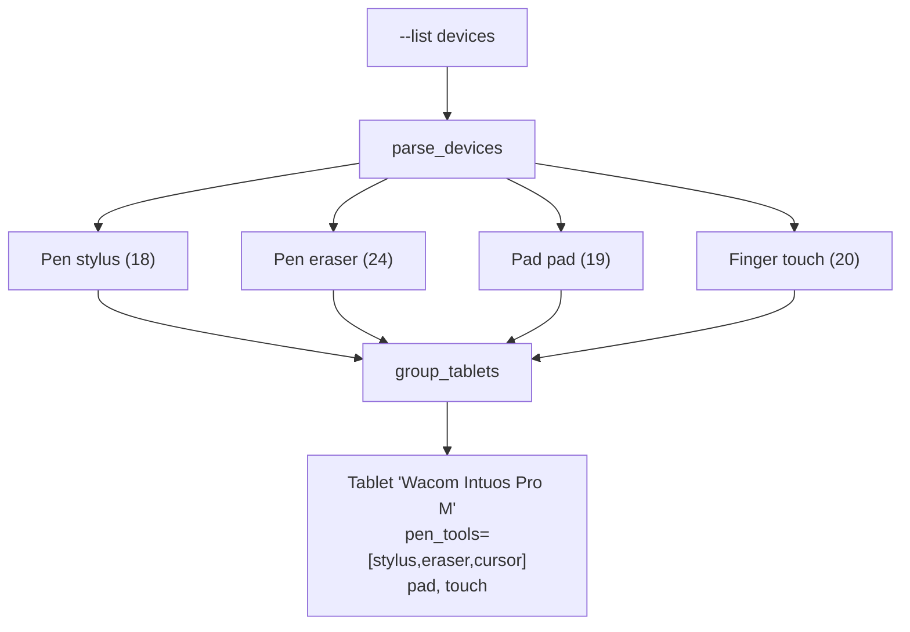

# `backend/` — Qt-free system I/O

The lowest layer: thin wrappers over the external tools the app shells out to. It imports
nothing from `core`, `ui`, or `PySide6`. Every module separates **parsing** (pure, string in →
dataclass out) from **I/O** (the `subprocess` call), so the parsers are tested against captured
fixture text with no device attached.

```
backend/
├── xsetwacom.py   # the xsetwacom CLI wrapper
├── devices.py     # discover + group Wacom tool devices into Tablets
└── displays.py    # enumerate display outputs via xrandr
```



## `xsetwacom.py`

The single chokepoint for the `xsetwacom` binary.

- **argv-list form always.** `subprocess.run(["xsetwacom", "--set", name, …])` — device names
  like `"Wacom Intuos Pro M Pen stylus"` contain spaces but need **no shell quoting** because
  there's no shell.
- **`dry_run` switch.** A module-level `dry_run` (or a per-call `dry=`) makes the mutating
  helpers (`set_param`, `reset_area`) *return* the argv they would run instead of running it.
  This powers `--dry-run` and lets tests assert exact commands.
- **`build_set_command(device, param, *values)`** is pure — it builds the argv and is reused by
  the apply-script generator and by `engine.py` when assembling a command list to preview.
- **`get` / `get_shell` / `get_shell_all`.** `get_shell_all` runs `-s --get <dev> all`, whose
  shell-format output lists button/action params as `set` lines — the only way to *discover*
  which buttons a pad actually has (parsed in `engine.parse_pad_buttons`).
- Errors raise **`XsetwacomError`** (non-zero exit, or binary missing); callers degrade
  gracefully (e.g. fall back to a default tablet size).

## `devices.py`

`xsetwacom` exposes each **tool** as its own device — one physical tablet appears as separate
`stylus` / `eraser` / `cursor` / `pad` / `touch` entries that share a surface.

- **`parse_devices`** turns `--list devices` lines into frozen `Device(name, id, type)`.
- **`tablet_base_name`** strips the trailing tool descriptor (` Pen stylus`, ` Pad pad`, …).
- **`group_tablets`** buckets tools by that base name into a `Tablet`, preserving order.
- **`Tablet`** offers the groupings callers need: `pen_tools` (stylus+eraser+cursor — mapping
  is applied to these *together*), `stylus`, `pad`, `touch`, and `by_type(*types)`.



## `displays.py`

We parse **`xrandr --listmonitors`** (not `QScreen`) because it yields the XRandR connector
name (`DP-4`, `HDMI-1`) that `xsetwacom`'s `MapToOutput` expects, and it works headlessly with
no running `QApplication`.

- **`Output(name, width, height, x, y, primary)`** with `.aspect` and `.geometry_str`
  (`WxH+X+Y`, the alternate `MapToOutput` form for whole-desktop).
- **`desktop_bounds(outputs)`** returns the bounding box spanning all outputs — used when
  mapping to the whole desktop rather than one connector.

## Testing

See `tests/test_backend.py`. Parsers are fed captured real-world output and asserted against
expected dataclasses; the mutating `xsetwacom` helpers are exercised in `dry_run` mode so no
device is touched.
