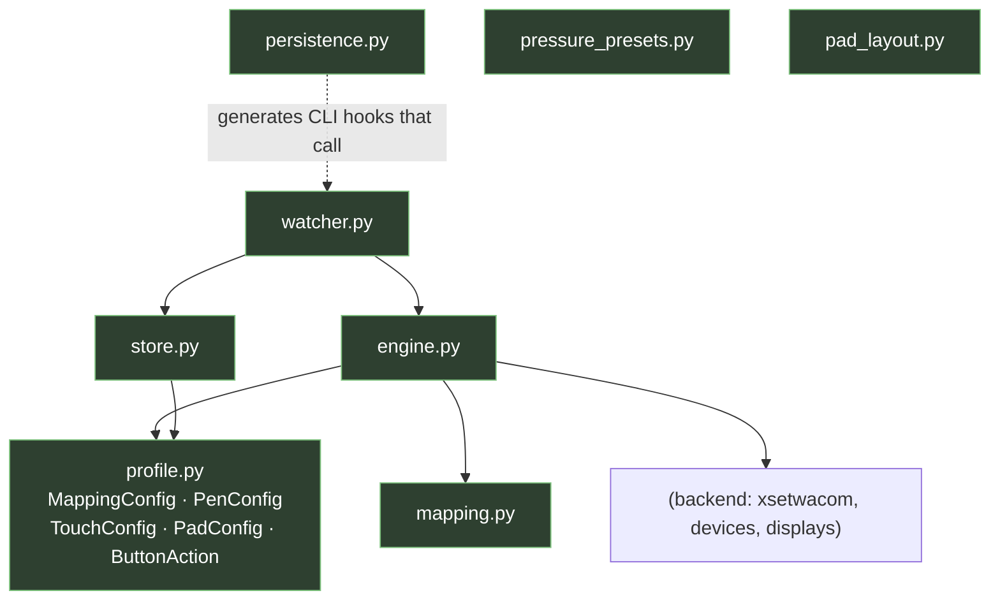
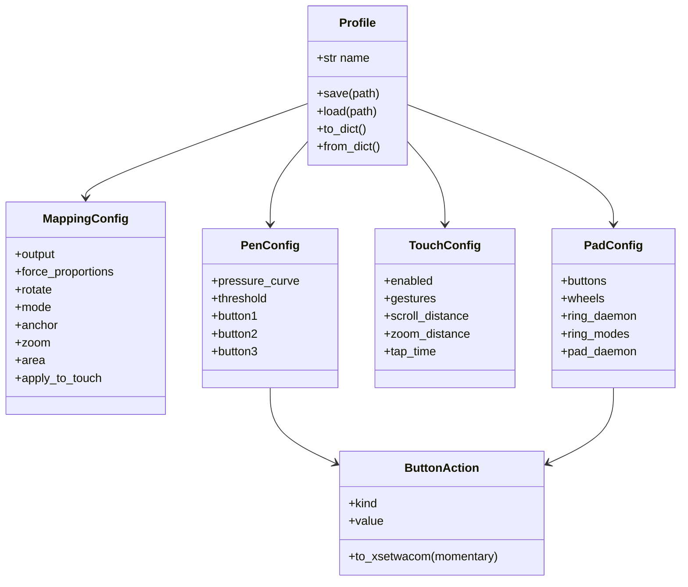

# `core/` — pure logic, models, persistence

Everything the app *knows how to do*, with **no Qt and no UI**. It depends only on
[`../backend`](../backend/README.md). Because it's Qt-free, the GUI view-models and the headless
CLI are interchangeable front-ends over these same functions — which is why `--dry-run` previews
exactly what the GUI applies.

```
core/
├── profile.py          # the data model: *Config dataclasses ⇄ JSON; ButtonAction grammar
├── engine.py           # Profile (+ live devices) → xsetwacom argv → run
├── mapping.py          # force-proportions / anchor / zoom / rotation math (pure)
├── store.py            # named profiles on disk + the active-profile pointer
├── persistence.py      # login autostart + systemd --user unit (pure renderers + side effects)
├── watcher.py          # hotplug watcher (pyudev, polling fallback)
├── pressure_presets.py # named pressure curves (built-ins + user)
├── pad_layout.py       # physical pad layout loaded from layouts/*.json (incl. evdev_buttons)
└── ring_setup.py       # reversible ring/pad-daemon install (udev rule + input group + service)
```



## `profile.py` — the data model

Plain `@dataclass`es that serialise to/from JSON; a `Profile` bundles one of each:



`kind` is one of `button` / `doubleclick` / `key` / `scroll` / `disabled`; `buttons` and
`wheels` are `dict[str, ButtonAction]`. `scroll` is realised by the evdev ring daemon (the ring
emits `REL_WHEEL`); `to_xsetwacom()` maps it to `"0"` because xsetwacom can't emit wheel events.

`PadConfig` carries three daemon flags:
- **`ring_daemon`** — switches the touch ring from xsetwacom keystroke fallback to real
  `REL_WHEEL` scroll (via the evdev daemon).
- **`ring_modes`** — per-LED-mode ring actions for the daemon; an empty list means "default
  scroll for every mode".
- **`pad_daemon`** — daemon grabs the whole pad (`EVIOCGRAB`) so express keys can inject real
  mouse buttons / scroll / click-drag; the xsetwacom bindings stay as a silent fallback floor.

**`ButtonAction.to_xsetwacom()` is the one place that knows the action-string grammar**, and it
encodes two hard-won rules:

- Mouse buttons emit the **held** form `button +N` (press-and-hold), because a bare `N` expands
  to `+N -N` (an instant click) and breaks click-and-drag.
- The touch **ring** asks for `momentary=True` → `+N -N`, because each ring detent is one
  discrete event and a never-released `+N` can't scroll.

`PadConfig` keys buttons by xsetwacom **button number** (string, for JSON friendliness) and the
ring by xsetwacom **wheel parameter** (`AbsWheelUp`/`Down`), so layouts stay generic.

## `engine.py` — config → commands → run

The shared heart. `profile_commands(profile, tablet, outputs)` = `mapping_commands` +
`pen_commands` + `touch_commands` + `pad_commands`, each a list of `xsetwacom` argv. `apply_*`
wraps that with execution (or returns the list under `dry_run`).

Mapping highlights:
- **`resolve_area`** recomputes the letterboxed area from [`mapping.py`](#mappingpy--the-math)
  when force-proportions is on, else uses the stored explicit area.
- **`tablet_native_area`** must probe the *true* size via `ResetArea` (then restore the previous
  area) and cache it — reading the current `Area` would shrink the tablet cumulatively on every
  Apply.
- Mapping (`Mode`/`Rotate`/`Area`/`MapToOutput`) is applied to **all pen tools together**, and
  to touch only when `apply_to_touch` is set.
- `detect_pad_buttons` / `parse_pad_buttons` discover the pad's real button numbers from
  `xsetwacom -s --get <pad> all`.

## `mapping.py` — the math

Pure integer/float geometry, no Qt, no subprocess:
- `target_area_aspect(output_aspect, rotate)` — reciprocal under `cw`/`ccw` (axes swap).
- `fit_rect(W, H, aspect)` — largest rect of `aspect` fitting `W×H` (the letterbox).
- `place_rect(...)` — anchor it (center / corners).
- `forced_area(...)` — ties it together with `zoom` ∈ (0,1], clamped to the tablet.

## `store.py` — profiles on disk

`~/.config/wacom-control-panel/` holds `state.json` (`{"active": name}`) and
`profiles/<slug>.json` (one `Profile` each). `ProfileStore` does CRUD + active selection;
`ensure_default()` guarantees at least one profile exists.

## `persistence.py` + `watcher.py` — auto-reapply

`xsetwacom` state is runtime-only. `persistence.py` writes, **with no root**, an XDG autostart
entry (runs `--apply-active` at login) and a `systemd --user` unit (runs `--watch`). Its
`render_*` methods are pure strings (unit-tested); `install`/`uninstall` do the side effects.
`watcher.py` reapplies the active profile when a Wacom device appears — event-driven via
`pyudev` when present, polling `xsetwacom --list devices` otherwise. See the persistence diagram
in the [top-level README](../../README.md#7-persistence-auto-reapply).

## `pressure_presets.py` & `pad_layout.py`

- **`pressure_presets.py`** — named `[x1,y1,x2,y2]` curves; built-ins (`Soft`/`Linear`/`Firm`)
  can't be deleted; user presets live in `pressure_presets.json`.
- **`pad_layout.py`** — loads a physical pad layout (which xsetwacom button is which key, plus
  the ring and the `evdev_buttons` code→number map) from
  [`../layouts/*.json`](../layouts/README.md), matched to a tablet by name substring, with a
  generic flat fallback for unknown models. **Note:** these numbers are hardware-measured, not
  from libwacom — see the [hardware notes](../../README.md#9-hard-won-hardware-notes).

## `ring_setup.py`

Reversible installer for the ring/pad daemon's permissions + user service — the **only
root-touching code in the project**:
- writes a udev rule granting `/dev/uinput` access to the `input` group;
- adds the user to `input` only if not already a member (records this in a marker file so
  `uninstall` reverses it only if we added it);
- writes, enables, and starts a `systemd --user` service that runs `--ring-daemon`.

All `render_*` methods return pure strings (unit-testable without touching the system);
`install`/`uninstall` do the side effects via an injectable `runner` (default: `pkexec`/`sudo`).
Also exposes `is_installed()`, `is_active()`, and `reload()` (sends `SIGHUP`) for the GUI's
readiness check and Save→reload flow.

## Testing

`tests/test_mapping.py`, `test_phase3.py` (command building + config round-trips, including
`ring_daemon`/`ring_modes`/`pad_daemon` round-trips and back-compat), `test_store.py`,
`test_persistence.py`, `test_pressure_presets.py`, `test_pad_layout.py`, `test_ring_setup.py`,
`test_keymap.py`, `test_ring_daemon.py` (evdev-guarded) — all pure, no device required.
