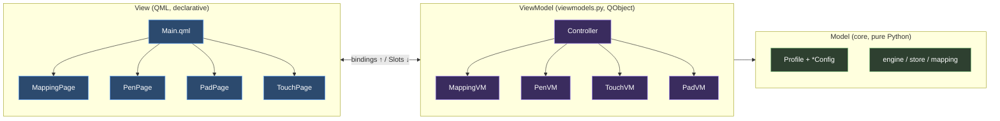

# `ui/` — QtQuick views + the MVVM bridge

This is the only Qt-aware layer. It is deliberately **thin**: every bit of real logic lives in
[`../core`](../core/README.md); the job here is to (a) expose `core` to QML as `QObject`
view-models, and (b) describe the screen declaratively in QML.

If you know Qt Widgets but not QtQuick, this doc is for you. The recurring theme is
**imperative → declarative**: instead of calling `widget.setValue(x)` whenever the model
changes, you declare *relationships* once and Qt keeps them true.

```
ui/
├── viewmodels.py     # QObject view-models — the Python⇄QML bridge
└── qml/
    ├── Main.qml          # ApplicationWindow: profile bar, TabBar, StackLayout, footer, dialogs
    ├── MappingPage.qml   # mapping controls + two linked canvases
    │   ├── ScreenView.qml        #   monitors drawn to scale; click to target
    │   └── TabletAreaView.qml     #   tablet + draggable/resizable active-area rect
    ├── PenPage.qml       # pressure curve + tip feel + pen buttons
    │   └── PressureCurve.qml      #   Canvas Bézier with DragHandler control points
    ├── PadPage.qml       # spatial pad mock (express keys + ring)
    ├── TouchPage.qml     # touch toggles + gesture sliders
    └── ActionEditor.qml  # reusable button-action picker (mouse vs keyboard-only)
```

---

## 1. The big picture: MVVM



- **Model** — dumb data + pure functions. Knows nothing about Qt or the screen.
- **ViewModel** — a `QObject` per UI concern. Holds a `*Config` from the model, exposes it as
  QML-readable **properties**, and accepts edits via **slots**. This is where UI policy lives
  (e.g. "recompute the area when force-proportions is on").
- **View** — QML. Reads view-model properties through bindings, calls slots on interaction.
  Contains no business logic.

Why bother: the model stays trivially testable, and the QML could be swapped for a Widgets UI
(or a CLI) without touching logic. The headless CLI in [`../__main__.py`](../__main__.py) is
proof — it drives the same `core` directly, no view-models at all.

---

## 2. Bootstrap: how Python and QML meet

[`app.py`](app.py) is the whole wiring:

```python
app = QGuiApplication(...)
QQuickStyle.setStyle("Material")              # Material style (Dark theme set in Main.qml)

controller = Controller()                     # composition root: builds every sub-view-model
engine = QQmlApplicationEngine()
engine.rootContext().setContextProperty("controller", controller)   # ← the bridge
engine.load(QUrl.fromLocalFile(str(QML_MAIN)))                       # load Main.qml
...
return app.exec()
```

Two things to internalise:

1. **`setContextProperty("controller", controller)`** injects one Python object into the QML
   global scope under the name `controller`. Every `.qml` file can then reference
   `controller.mapping.areaX1`, `controller.apply()`, etc. There is no other wiring — no
   `findChild`, no manual signal connections per control. (The alternative, `qmlRegisterType`,
   registers a *type* QML can instantiate; here we want a single shared instance, so a context
   property is the right tool.)

2. **`QGuiApplication`** (not `QApplication`). QtQuick doesn't need the Widgets module, so we
   use the lighter GUI application class.

`QML_MAIN` is a filesystem path; `pyproject.toml`'s `package-data` ships the `qml/*.qml` and
`layouts/*.json` so they're present in an installed wheel too.

---

## 3. Properties are bindings, not setters

The single most important shift. In Widgets you imperatively push changes:

```python
# Widgets style — you call this every time the model changes
spin.setValue(cfg.area.x1)
```

In QML you declare the relationship **once**, and it stays live:

```qml
// TabletAreaView.qml — the rectangle's geometry *is* the view-model's area
Rectangle {
    id: area
    x:      root.devToPxX(controller.mapping.areaX1)
    y:      root.devToPxY(controller.mapping.areaY1)
    width:  (controller.mapping.areaX2 - controller.mapping.areaX1) * root.s
    height: (controller.mapping.areaY2 - controller.mapping.areaY1) * root.s
}
```

When the area changes — from a drag, a spin-box, or the force-proportions recompute — this
rectangle and the four `SpinBox`es in `MappingPage.qml` *all* update, with zero extra code.
That only works because the property tells Qt **when** it changed, via a `NOTIFY` signal.

### The Python side: `Property` + `Signal`

```python
class MappingVM(QObject):
    changed = Signal()       # NOTIFY for the scalar options
    areaChanged = Signal()   # NOTIFY specifically for the active area

    # read-only computed property; re-reads whenever areaChanged fires
    areaX1 = Property(int, lambda self: self._area().x1, notify=areaChanged)
```

`Property(type, getter, [setter], notify=signal)` is the QML-visible declaration. With only a
getter it's read-only from QML. The `notify` signal is the contract: *"any binding that read me
must re-evaluate when this fires."* If you forget `notify`, the binding reads once and goes
stale — the classic first-QML-bug.

### Editing: `Slot` (or a writable property setter)

Edits flow the other way — QML calls Python, Python mutates the pure model, then emits the
NOTIFY signal to close the loop:

```python
@Slot(int, int, int, int)
def setAreaFromCanvas(self, x1, y1, x2, y2):
    self._m.set_area(Area(x1, y1, x2, y2))   # mutate the core model
    self.areaChanged.emit()                  # → bindings re-evaluate
```

```qml
// called from the drag handler
controller.mapping.setAreaFromCanvas(nx, ny, nx + w, ny + h)
```

Some properties are writable instead, with a setter that QML assigns to directly:

```python
def _set_force(self, v: bool):
    if v != self._m.force_proportions:
        self._m.force_proportions = v
        self._recompute()       # UI policy: re-letterbox the area
        self.changed.emit()
forceProportions = Property(bool, _get_force, _set_force, notify=changed)
```

```qml
CheckBox {
    checked: controller.mapping.forceProportions
    onToggled: controller.mapping.forceProportions = checked
}
```

> **Design choice in this repo:** we favour **read-property + explicit setter/slot** over
> two-way property bindings. Data flow stays one-directional (QML reads, QML calls a setter,
> Python emits, QML re-reads), which is far easier to debug than two endpoints mutating each
> other. A guard like `if v != current` prevents notify storms.

```mermaid
sequenceDiagram
    participant QML
    participant VM as ViewModel
    participant Cfg as core *Config
    QML->>VM: setX(value)  / property = value   [Slot/setter]
    VM->>Cfg: mutate pure model (+ UI policy)
    VM-->>QML: someChanged()  [Signal/NOTIFY]
    QML->>VM: re-read bound properties  [getter]
    Note over QML: affected bindings re-evaluate; UI updates
```

---

## 4. List models without a `QAbstractItemModel`

You don't always need a full model class. A `Property` returning a `QVariantList` of dicts is
enough for a `Repeater`:

```python
def _get_output_rects(self) -> list:
    return [
        {"name": o.name, "x": o.x, "y": o.y, "width": o.width,
         "height": o.height, "primary": o.primary, "selected": ...}
        for o in self._outputs
    ]
outputRects = Property("QVariantList", _get_output_rects, notify=changed)
```

```qml
// ScreenView.qml
Repeater {
    model: root.rects                 // the QVariantList
    delegate: Rectangle {
        required property var modelData      // each dict
        x: root.ox + (modelData.x - root.bounds.x) * root.s
        color: modelData.selected ? "#2c4a6e" : "#343438"
        MouseArea { onClicked: controller.mapping.selectOutputByName(mon.modelData.name) }
    }
}
```

`required property var modelData` is the modern (Qt 6) way to receive each row — explicit and
lint-friendly versus the old implicit `model.*` context properties. `PadVM.topKeys`/`bottomKeys`
use the same trick to drive the pad mock. Dicts are fine for small, mostly-static lists; reach
for `QAbstractListModel` only when you need large/incremental/row-change semantics.

---

## 5. Composition: the `Controller` as root

`Controller` is the one object QML sees; it owns the sub-view-models and exposes them as
**constant** properties (they never get reassigned, so no NOTIFY needed):

```python
class Controller(QObject):
    mapping = Property(QObject, lambda self: self._mapping, constant=True)
    pen     = Property(QObject, lambda self: self._pen,     constant=True)
    touch   = Property(QObject, lambda self: self._touch,   constant=True)
    pad     = Property(QObject, lambda self: self._pad,     constant=True)
```

So QML addresses things by path: `controller.pen.threshold`, `controller.pad.topKeys`. The
controller also carries the cross-cutting actions — profile CRUD, `apply()`/`save()`/`revert()`,
persistence toggle — and a `statusMessage(str)` signal that `Main.qml` shows in the footer:

```qml
Connections {
    target: controller
    function onStatusMessage(msg) { win.status = msg }
}
```

`Connections` is how QML subscribes to an arbitrary signal (here, one that isn't a property
NOTIFY). `apply()` gathers all four sub-view-models into a single `Profile` and hands it to
`engine.apply_profile` — that assembly is the only place the four concerns meet.

---

## 6. Custom drawing inside a declarative tree

Two components paint themselves instead of using stock controls.

### `PressureCurve.qml` — `Canvas` + `DragHandler`

The curve is an HTML-canvas-style imperative paint, re-triggered whenever an input changes:

```qml
Canvas {
    id: canvas
    onPaint: { var ctx = getContext("2d"); ctx.reset(); /* grid + Bézier */ }
}
// re-paint when any control point or the size changes
onP1xChanged: canvas.requestPaint()
```

The draggable handles use **`DragHandler`, not `MouseArea`** — on purpose:

```qml
component Handle: Rectangle {
    DragHandler {
        id: drag
        target: null                 // we don't move the handle; we compute a value
        onTranslationChanged: parent.commit(
            root.clamp(parent.startX + root.dvx(translation.x)),
            root.clamp(parent.startY + root.dvy(translation.y)))
    }
}
```

Why it matters: a plain `MouseArea` can **lose its grab** mid-drag when stylus/tablet input is
involved, so handles "fall off". `DragHandler` keeps an *exclusive pointer grab* for the whole
gesture. `target: null` means "don't auto-move me" — we instead translate the pixel delta into
a 0–100 value and push it to the view-model (`controller.pen.p1x = nx`). The handle's position
then comes *back* through the binding `x: root.px(vx) - width/2`, so the model stays the single
source of truth.

### `TabletAreaView.qml` — one `MouseArea`, hand-rolled hit-testing

The draggable/resizable area uses a single full-bleed `MouseArea` that mirrors the
device-coordinate math: on press it decides `"resize"` (near the bottom-right handle), `"move"`
(inside the rect), or nothing; on drag it converts pixels back to device units and calls
`setAreaFromCanvas(...)`. When force-proportions is on, resize keeps the aspect:

```qml
if (controller.mapping.forceProportions) {
    var aspect = (a[2]-a[0]) / Math.max(1, a[3]-a[1])
    newh = neww / aspect
}
```

This is the imperative-inside-declarative pattern: the *interaction* is procedural, but its
*result* is one slot call, after which bindings redraw everything.

---

## 7. Structure, theming, dialogs (the `Main.qml` tour)

- **`ApplicationWindow`** with `header` (profile bar + `TabBar`), body, and `footer`
  (Apply/Revert/Save + persistence checkbox + status).
- **Tabs → pages** via a `StackLayout` whose `currentIndex` binds to the `TabBar`:

  ```qml
  TabBar { id: tabs; TabButton { text: "Mapping" } /* … */ }
  StackLayout { currentIndex: tabs.currentIndex
      MappingPage {} PenPage {} PadPage {} TouchPage {} }
  ```
- **Material Dark**: `Material.theme: Material.Dark`, `Material.accent: Material.Blue`. Tool-bars
  get explicit dark `background` rectangles + light text (the stock toolbar was illegible on
  dark, an early fix).
- **Dialogs** (`New`/`Duplicate`/`Rename`/`Delete`, and the pressure-preset save dialog) are
  `Dialog` items with `standardButtons` and an `onAccepted` that calls a controller slot. The
  name dialog reuses one component for three actions via an `action` property.

---

## 8. Recipe: add a new tab

1. **Model** — add fields to a `*Config` in [`../core/profile.py`](../core/profile.py) and
   handle them in `engine.py`'s `*_commands`.
2. **ViewModel** — add a `QObject` (or extend one) in `viewmodels.py` with `Property`s
   (+ NOTIFY) for reads and `@Slot`s for edits; expose it from `Controller` as a `constant`
   property; load/save it in `_load_profile` / `_current_profile`.
3. **View** — add a `FooPage.qml`, bind to `controller.foo.*`, and add a `TabButton` +
   the page to the `StackLayout` in `Main.qml`.
4. **Tests** — config round-trip + command building in `tests/`, and view-model behaviour
   under `QT_QPA_PLATFORM=offscreen`.

---

## 9. Gotchas

- **Headless tests:** run QML/view-model tests with `QT_QPA_PLATFORM=offscreen`.
- **`controller is null` on shutdown:** harmless teardown noise when the QML engine is torn
  down before its bindings; not a load failure.
- **Forgot `notify=`?** The binding reads once and never updates. If a value "won't refresh,"
  check the property has a NOTIFY signal and that you actually `emit` it.
- **Two-way binding loops:** assigning to a property whose binding feeds back can loop; the
  guard pattern (`if new != current: …; emit`) and one-way reads avoid it. See the modifier
  checkboxes in `ActionEditor.qml` for an explicit `syncing` guard around programmatic updates.
- **`required property var modelData`** in delegates is preferred over implicit context
  properties — clearer and survives QML lint.
